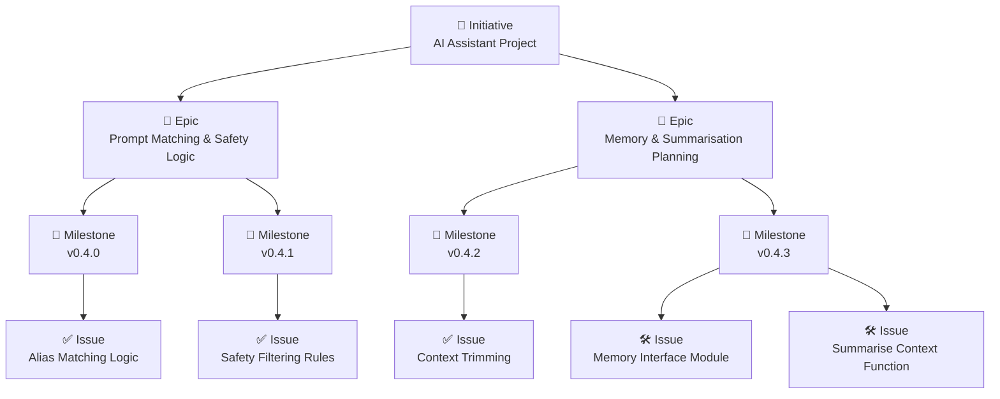

# LLM Assistant Project

## Project Overview

This is a learning-focused project designed to explore how large language models (LLMs) can be structured, prompted, extended, and eventually fine-tuned.
It started as a basic chatbot interface and is progressively evolving into a broader AI learning platform.

**Key Objectives:**

- Learn by doing — not just model usage, but structure, evaluation, and scaling
- Build repeatable workflows for prompt engineering, testing, and automation
- Create modular, extensible components for chat, memory, summarisation, and tooling

---

## Current Status

- **Latest completed version:** `v0.4.1` – Safety guardrails and post-filtering
- **In progress:** `v0.4.2` – Context memory handling & project hygiene
- **Planned next:** `v0.4.3` – Memory backend and summarisation scaffolding

See [Release Notes](./docs/release_notes.md) for full version history.

---

## Project Structure

- `main.py` – Gradio chatbot entry point
- `utils/` – Helpers for prompts, aliases, context prep, etc.
- `config/` – Base prompt, specialized prompts, and settings
- `memory.py` – Placeholder module for memory recall integration (from v0.4.3)
- `experiments/` – Version-specific exploratory code (e.g. summarisation, prompt testing)
- `tests/` – Unit tests for core logic
- `docs/` – Planning docs, roadmap, scope, and supporting content

---

## How We Work

All development is structured and tracked using GitHub Projects, organised as follows:

- **Project Board** → [LLM Project Board](https://github.com/users/Deim0s13/projects/4/views/1)
  This is the source of truth for all planning, backlog items, and active work.

### Tracking Structure

- **Initiatives** – High-level projects (e.g. AI Assistant, Smart Note Taker, Fine-Tuning Playground)
- **Epics** – Feature themes (e.g. Prompt Matching, Memory Integration, Summarisation)
- **Milestones** – Versioned releases (`v0.4.2`, `v0.4.3`, etc.)
- **Issues** – Individual, scoped tasks linked to epics and milestones

We follow a **top-down planning model**:
Initiative ➜ Epic ➜ Milestone ➜ Task (Issue)

All tasks are represented as GitHub Issues and tracked on the board through columns:

- `Backlog` ➜ `Next Up` ➜ `In Progress` ➜ `Done`

### 🧪 Workflow Principles

- All new work is created as an **issue**, linked to an **epic** and **milestone**
- Each version release is scoped first in `scope.md`, then broken into trackable tasks
- Tasks are assigned labels (`feature`, `testing`, `summarisation`, etc.) for filtering
- Pull requests reference issues using `fixes #XX` for automatic tracking and closure

### 👥 Contributing

Please review the [`CONTRIBUTING.md`](./docs/CONTRIBUTING.md) file before submitting a PR.
We use **feature branches**, structured naming (`feature/`, `fix/`), and PRs for all changes.

> 📊 The diagram below shows how initiatives, epics, milestones, and issues relate to each other.



---

## Setup Instructions

- Clone the repo

```bash
git clone https://github.com/<your-username>/llm-assistant.git
cd llm-assistant
```

- (Optional) Set up virtual environment

```bash
python3 -m venv venv
source venv/bin/activate
```

- Install dependencies

```bash
pip install -r requirements.txt
```

- Run the app

```bash
python main.py
```

For more detail, refer to `SETUP.md` (coming soon)

---

### Environment Overrides (.env Support)

Environment-based overrides are supported using a `.env` file placed in the **project root**. This allows local configuration without modifying version-controlled files like `config/settings.json`.

We use `python-dotenv` to automatically load environment variables before settings are applied.

#### How it Works

- At startup, `.env` variables are loaded before `settings.json`
- If an environment variable exists with the same name as a setting, it will override the value in memory
- These overrides are logged (in debug mode) to confirm what's active

#### Example `.env` file

```env
DEBUG_MODE=True
LOG_TO_FILE=False
MAX_HISTORY_TURNS=5
MODEL_DEVICE=mps
```

#### 🔧 Supported Overrides

The following environment variables can be used to override settings at runtime via a `.env` file in the project root.

| Environment Variable | Description                                                  | Type     | Example Value |
|----------------------|--------------------------------------------------------------|----------|----------------|
| `DEBUG_MODE`         | Enables or disables debug logging                            | Boolean  | `True`         |
| `LOG_TO_FILE`        | Enables or disables logging to a file                        | Boolean  | `False`        |
| `MAX_HISTORY_TURNS`  | Maximum number of past user/assistant turns to retain        | Integer  | `5`            |
| `MODEL_DEVICE`       | Force the model to run on a specific device (`cpu`, `cuda`, or `mps`) | String   | `mps`          |
| `TEMPERATURE`        | Override generation temperature (controls randomness)        | Float    | `0.5`          |
| `TOP_P`              | Override nucleus sampling parameter                          | Float    | `0.9`          |
| `MAX_NEW_TOKENS`     | Override the number of tokens to generate                    | Integer  | `100`          |

> These overrides take effect at application startup. If a variable is not present, the default in `settings.json` or the fallback config will be used.
>
> Environment variables must match the key names in settings (converted to uppercase with underscores).

---

```env
# Example .env file
DEBUG_MODE=True
LOG_TO_FILE=False
MAX_HISTORY_TURNS=5
MODEL_DEVICE=mps
TEMPERATURE=0.5
TOP_P=0.9
MAX_NEW_TOKENS=100
```

---

## Learning Journey Roadmap

This is a staged, evolving project. See [ROADMAP.md](./docs/roadmap.md) for full phase breakdown.

- **Phase 1:** Basic Chatbot & Prompt Engineering
- **Phase 2:** Fine-Tuning a Model (LoRA, QLoRA)
- **Phase 3:** Deployment, Scaling, Tool Integration

Each phase builds on the previous while preserving modularity and traceability.

---

## Useful Links

- [GitHub Project Board](https://github.com/users/Deim0s13/projects/4/views/1)
- [Release Notes](./docs/release_notes.md)
- [Scope](./docs/scope.md)
- [Test Experiments Tracker](./docs/experiments_tracker.md)
- [Learning Roadmap](./docs/roadmap.md)

---

## Acknowledgments & Future Vision

This is an open-ended project for hands-on learning, experimentation, and modular development in the LLM space.

**Future goals include:**

- Chat memory persistence (e.g. Redis)
- Fine-tuning + evaluation tracking
- RAG pipelines
- Dev agent / assistant simulation
- Scalable deployments (e.g. OpenShift)

> Stay curious. Stay iterative. Stay improving.
