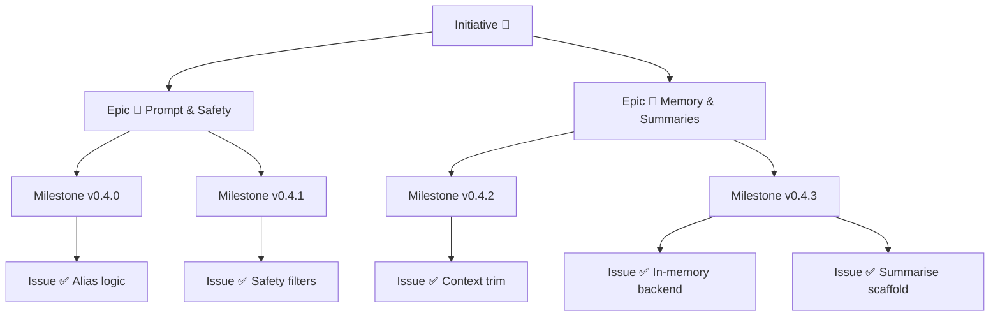

# 🧠 LLM‑Assistant Starter Kit

A hands‑on project for **learning** how to structure, prompt, extend, \_and eventually fine‑tune\_ LLM-powered applications.
What began as a single‑file chatbot has grown into a modular playground for **prompt engineering**, **memory handling**, **summarisation**, and (soon) **RAG** & **fine‑tuning**.

---

## Key Objectives

* **Learn by doing** – prompts, context windows, safety & memory techniques.
* **Repeatable workflows** – versioned releases, unit‑tests, GitHub Projects.
* **Modular code** – swap back‑ends (Redis memory, vector DB, containers) with minimal friction.

---

## Project Status

| Track             | Version      | Notes                                                                           |
| ----------------- | ------------ | ------------------------------------------------------------------------------- |
| **Latest stable** | **`v0.4.2`** | Context‑window trimming, cross‑platform hygiene                                 |
| **In progress**   | **`v0.4.3`** | 🗄️ **In‑memory backend**, 📝 **summarise scaffold**, 🔬 **initial unit‑tests** |
| **Planned next**  | **`v0.4.4`** | 🔧 Persistent memory, Summarise MVP, CI pipeline                                |

*See the full changelog → **[Release Notes](./docs/release_notes.md)**.*

---

## Directory Map

```text
.
├── main.py                 # Gradio chat loop & prompt pipeline
├── utils/
│   ├── memory.py           # In‑memory backend façade (v0.4.3)
│   ├── summariser.py       # summarise_context() scaffold
│   ├── aliases.py          # Alias → concept mappings
│   ├── prompt_utils.py     # In‑order token alias helper
│   └── safety_filters.py   # Profanity & safety checks
├── config/
│   ├── settings.json       # Runtime config (memory, safety, logging …)
│   ├── prompt_template.txt # Base system prompt
│   └── specialized_prompts.json
├── experiments/            # Exploratory scripts & notebooks
│   ├── summarisation_playground.py  # simple summary prototype
│   └── …                    # memory toggle / context tests
├── tests/                  # **PyTest** suites (memory, context …)
├── scripts/
│   └── activate_tests.sh   # helper → sets PYTHONPATH + runs smoke tests
└── docs/                   # Roadmap · Scope · Dev checklist · …
```

---

## Workflow & Planning

Work is managed in **GitHub Projects** → ▶ [LLM Project Board](https://github.com/users/Deim0s13/projects/4/views/1).

```
Initiative → Epic → Milestone (version) → Issue (task)
```

* Every change begins as an **Issue** linked to its Epic & Milestone.
* PRs flow **feature → dev → main** and include `fixes #id`.

See full contributor notes in **[`CONTRIBUTING.md`](./docs/CONTRIBUTING.md)**.

### Visual overview



---

## Quick‑start 🏃‍♂️

```bash
git clone https://github.com/<you>/llm-assistant.git
cd llm-assistant

python -m venv venv          # optional but recommended
source venv/bin/activate     # Windows: venv\Scripts\activate

pip install -r requirements.txt
python main.py
```

---

### Environment Overrides (`.env`)

Drop a `.env` in the project root to override `settings.json`
without touching tracked config:

```env
DEBUG_MODE=true
MAX_HISTORY_TURNS=6
MODEL_DEVICE=mps      # cpu | cuda | mps
```

Supported keys & examples → **docs/dev\_checklist.md**

---

### Platform Setup 💻

| OS                   | Key steps                                                                                                               |
| -------------------- | ----------------------------------------------------------------------------------------------------------------------- |
| **macOS (M‑series)** | Python 3.10+, `pip install torch torchvision torchaudio` (MPS wheels)                                                   |
| **Windows + CUDA**   | Install CUDA Toolkit then `pip install torch torchvision torchaudio --index-url https://download.pytorch.org/whl/cu121` |

More detail & troubleshooting → **Cross‑Platform Dev Checklist**.

---

## Unit‑tests 🧪

Run smoke tests & memory‑toggle checks:

```bash
source scripts/activate_tests.sh       # sets PYTHONPATH + runs tests
# or
pytest -q                              # full suite
```

CI integration arrives in **v0.4.4** (lint + tests on every PR).

---

## Learning Roadmap

1. **Phase 1** – Prompt engineering & baseline chatbot *(v0.1 → v0.4.x)*
2. **Phase 2** – Fine‑tuning playground *(v0.6.x → v0.7.x)*
3. **Phase 3** – Packaging, scaling & RAG *(v0.8.x → v1.0)*

See **[`ROADMAP.md`](./docs/roadmap.md)** for the detailed timeline.

---

## Useful Links

* 🗂 Board – [https://github.com/users/Deim0s13/projects/4/views/1](https://github.com/users/Deim0s13/projects/4/views/1)
* 📑 [Scope](./docs/scope.md)
* 🪵 [Release Notes](./docs/release_notes.md)
* 🔬 [Experiments Tracker](./docs/experiments_tracker.md)
* 📝 [Summarisation Planning](./docs/summarisation_planning.md)

---

## Future Vision ✨

* Redis / vector‑DB memory back‑ends
* Automated regression tests & CI matrix
* RAG pipelines for knowledge‑base answers
* Containerised deployment on OpenShift
* Dev‑agent capabilities & self‑evaluation loops

> **Stay curious. Iterate often. Share learnings.**
