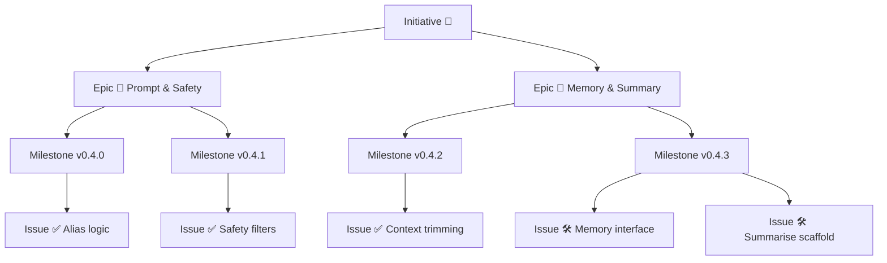

# 🧠 LLM‑Assistant Starter Kit

A hands‑on project for **learning** how to structure, prompt, extend and fine‑tune LLM‑powered applications. What began as a one‑file chatbot has grown into a modular playground for **prompt engineering**, **memory handling**, **summarisation** and (soon) RAG & fine‑tuning.

---

## Key Objectives

* **Learn by doing** – prompts, context windows, safety & memory techniques.
* **Repeatable workflows** – versioned releases, tests, GitHub Projects.
* **Modular code** – swap in new back‑ends (Redis memory, vector DB, containers).

---

## Project Status

| Track             | Version      | Notes                                           |
| ----------------- | ------------ | ----------------------------------------------- |
| **Latest stable** | **`v0.4.2`** | Context‑window trimming, cross‑platform hygiene |
| **In progress**   | **`v0.4.3`** | 🗄️ Memory interface & summarisation scaffold   |
| **Planned next**  | **`v0.4.4`** | 🔧 Automated tests & CI                         |

*Full changelog*: **[Release Notes](./docs/release_notes.md)**

---

## Directory Map

```text
.
├── main.py                 # Gradio chat loop & prompt pipeline
├── utils/
│   ├── memory.py           # In‑memory backend facade (v0.4.3)
│   ├── aliases.py          # Alias → concept mappings
│   ├── prompt_utils.py     # In‑order token alias match helper
│   └── safety_filters.py   # Profanity & safety checks
├── config/
│   ├── settings.json       # Runtime config (safety, memory, logging …)
│   ├── prompt_template.txt # Base system prompt
│   └── specialized_prompts.json
├── experiments/            # Exploratory notebooks & scripts
├── tests/                  # (Planned) pytest suites
└── docs/                   # Roadmap · Scope · Dev checklist · …
```

---

## Workflow & Planning

Work is managed in **GitHub Projects** → [Project Board](https://github.com/users/Deim0s13/projects/4/views/1).

```
Initiative → Epic → Milestone (version) → Issue (task)
```

* Every change begins as an **Issue** linked to its Epic/Milestone.
* PRs flow **feature → dev → main** and include `fixes #id`.

See full guidelines in **[`CONTRIBUTING.md`](./docs/CONTRIBUTING.md)**.

### Visual overview



---

## Quick‑start 🏃‍♂️

```bash
git clone https://github.com/<you>/llm-assistant.git
cd llm-assistant

python -m venv venv   # optional but recommended
source venv/bin/activate  # Windows: venv\Scripts\activate

pip install -r requirements.txt
python main.py
```

---

### Environment Overrides (`.env`)

Create a `.env` in project root to tweak config **without** editing `settings.json`.

```env
DEBUG_MODE=true
LOG_TO_FILE=true
MAX_HISTORY_TURNS=6
MODEL_DEVICE=cpu   # cpu|cuda|mps
```

Supported keys & examples → **docs/dev\_checklist.md**

---

### Platform Setup 💻

| OS                   | Key steps                                                                                                               |
| -------------------- | ----------------------------------------------------------------------------------------------------------------------- |
| **macOS (M‑series)** | Python 3.10+, `pip install torch torchvision torchaudio` (MPS wheels)                                                   |
| **Windows + CUDA**   | Install CUDA Toolkit then `pip install torch torchvision torchaudio --index-url https://download.pytorch.org/whl/cu121` |

More detail & troubleshooting → **Cross‑Platform Dev Checklist**.

---

## Learning Roadmap

1. **Phase 1** – Prompt engineering & baseline chatbot.
2. **Phase 2** – Fine‑tuning (LoRA / QLoRA) with tracking.
3. **Phase 3** – Packaging & scaling (containers, RAG, agents).

See **[`ROADMAP.md`](./docs/roadmap.md)** for specifics.

---

## Useful Links

* 🗂 Board – [https://github.com/users/Deim0s13/projects/4/views/1](https://github.com/users/Deim0s13/projects/4/views/1)
* 📝 [Scope](./docs/scope.md)
* 🪵 [Release Notes](./docs/release_notes.md)
* 🔬 [Experiments Tracker](./docs/experiments_tracker.md)

---

## Future Vision ✨

* Persistent memory back‑ends (Redis / vector DB)
* Automated regression tests & CI
* RAG pipelines for knowledge‑base answers
* Containerised deployment on OpenShift
* Dev‑agent capabilities & self‑evaluation loops

> **Stay curious. Iterate often. Share learnings.**
