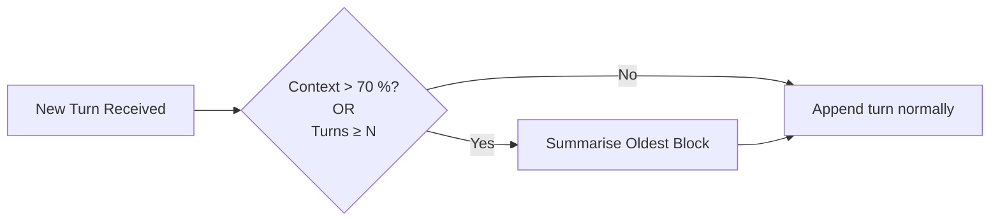

# Summarisation Strategy – Planning & Design

*Document location*: `docs/summarisation_planning.md`

---

## 1  Why Summarise?

Large‑language‑model sessions can exceed the model’s context window (e.g. 4 k‑8 k tokens for most open‑weights). Summarising past turns lets us:

* **Stay within token limits** while retaining salient information.
* **Speed up generation** (fewer tokens = faster inference & lower cost).
* Provide **long‑term memory hooks** for future recall modules (v0.6 +).

---

## 2  Constraints & Design Guard‑Rails

| Constraint                                          | Impact on Design                                     | Notes                                                                           |
| --------------------------------------------------- | ---------------------------------------------------- | ------------------------------------------------------------------------------- |
| **Context window** (≲ 4096 tokens for FLAN‑T5‑base) | Must trim / compress older turns                     | Hard failure if exceeded                                                        |
| **Real‑time chat latency**                          | Heavier LLM calls may block UI                       | Keep heuristics fast; off‑load expensive jobs to background thread or on‑demand |
| **Hallucination / trust**                           | LLM‑generated summaries may fabricate details        | Retain raw log or allow user to expand “full history”                           |
| **Cost** (if using hosted APIs)                     | Frequent summarise calls can be expensive            | Batch or threshold triggers                                                     |
| **Determinism for tests**                           | Randomness in LLM summaries complicates unit testing | Seeded decoding or deterministic heuristics for CI                              |

---

## 3  Candidate Approaches

### 3.1 Heuristic (Rule‑Based)

* **Last‑N**: keep last *N* turns verbatim.
* **User‑only**: store raw user prompts; regenerate assistant answers on demand.
* **Keyword extraction**: use regex / TF‑IDF to keep sentences with nouns / verbs of interest.

> ✅ Fast, deterministic, no hallucination risk.
> ❌ May drop important context; no semantic compression.

### 3.2 LLM‑Generated Summary

*Feed chunk to a small summarisation model (e.g. `t5-small summarise:`) and store concise paragraph.*

Trigger ideas:

* Every **K** turns (e.g. 10).
* When **token budget** > 70 %.
* Manual “⚡ Summarise now” developer button.

> ✅ High compression, semantically aware.
> ❌ Adds latency, token cost, & hallucination risk; summary quality varies.

### 3.3 Hybrid / Incremental

1. Apply **heuristics** first (last‑N, user‑only).
2. If still over budget → call **LLM summary** on older slice.
3. Cache summaries so each chunk is processed once.

> ✅ Balances speed & fidelity.
> ❌ More complex state handling.

---

## 4  When to Summarise? (Trigger Matrix)

Alternative trigger knobs:

* **Token threshold** (absolute)
* **Time‑based** (every 5 minutes of conversation)
* **User explicit** ("/summarise" command)

---

## 5  Risk Mitigation

* **Store raw** historical log alongside summaries for audit.
* Flag LLM summaries with *\[ai‑summary]* marker in prompt so downstream chain can treat them differently.
* Include *confidence* / temperature meta so we can tune hallucination likelihood.

---

## 6  Integration Roadmap

| Version    | Deliverable                                                        |
| ---------- | ------------------------------------------------------------------ |
| **v0.4.3** | `summarise_context()` scaffold (✓) and playground prototype        |
| **v0.5.x** | Heuristic + manual trigger inside main flow                        |
| **v0.6.x** | Hybrid strategy, background summariser worker, persisted summaries |
| **v0.7+**  | Fine‑tuned summariser model / RAG‑backed memory                    |

---

## 7  Open Questions

* How to reference entities across summaries (coref)?
* Should we retain *assistant* reasoning chains or let them drop?
* Do we summarise **per user** session or global conversation?

---

## 8  Next Steps for Devs

1. Review this doc and raise issues for any new constraints.
2. Vote on default trigger & strategy for v0.5 implementation.
3. Prototype LLM summary quality using `t5-small` or OpenAI *text-babbage-002*.

> *Feel free to extend this living document as experiments continue.*
